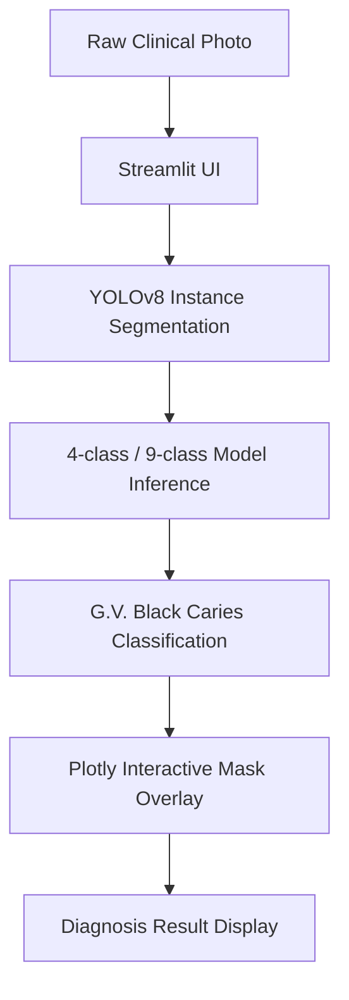
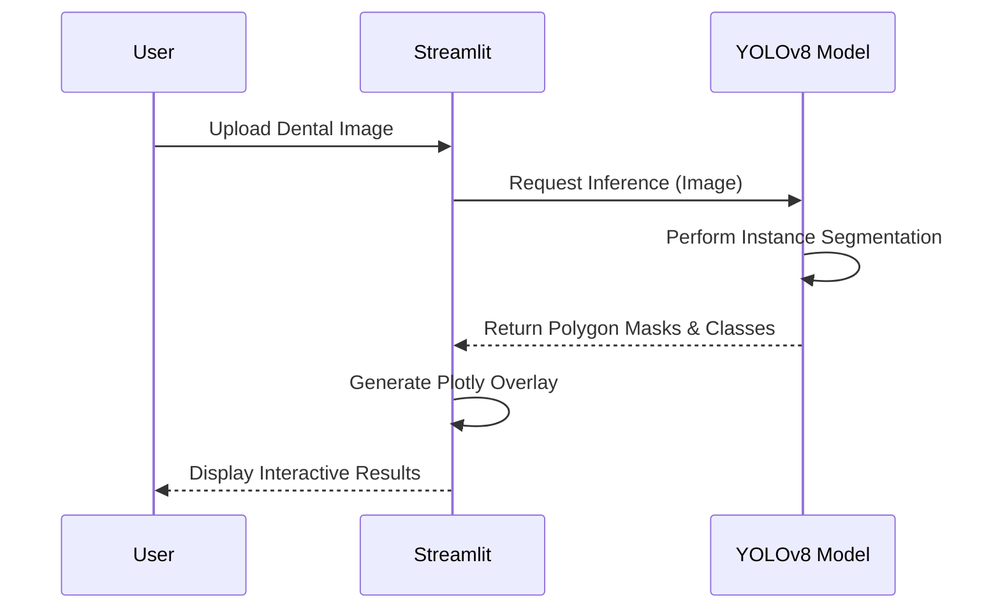

    

# 사진을 통한 치아 우식증 탐지 (Caries Detection from Photo)

사진을 통한 치아 우식증 탐지는 YOLOv8 인스턴스 분할을 기반으로 한 자동화된 치아 우식증 탐지 및 진단 보조 시스템입니다.


## 📥 Dataset & Model Checkpoints Setup
이 프로젝트는 대용량 데이터셋과 사전 학습된 모델 가중치(Checkpoints)가 필요합니다. 
(GitHub에는 소스코드만 올라가 있습니다.)

1. 프로젝트를 클론한 후, 먼저 `setup_env.py` 스크립트를 실행하여 데이터와 가중치를 허깅페이스에서 다운로드하세요.
   ```bash
   pip install huggingface_hub
   python setup_env.py
   ```
2. **주의사항 (`.env` 파일):** 
   이 프로젝트를 온전히 실행하기 위해서는 로컬 환경변수나 API 키가 포함된 `.env` 파일이 필요할 수 있습니다. 클론해서 사용하실 분은 레포지토리 주인에게 별도로 연락하여 `.env` 파일을 요청해 주시기 바랍니다.


## 기능

- 고정밀 인스턴스 분할: YOLOv8 아키텍처를 사용하여 G.V. Black 분류법을 기반으로 치아 우식증을 탐지하고 분할합니다.
- 대화형 웹 인터페이스: Streamlit으로 구축된 사용자 친화적인 웹 UI를 제공하여 실시간 이미지 업로드 및 분석이 가능합니다.
- 고급 시각화: Plotly를 활용하여 원본 임상 사진을 가리지 않고 대화형의 마우스 오버가 가능한 분할 마스크를 브라우저에 직접 렌더링합니다.
- 이중 모델 지원: 간소화된 4개 클래스 모델과 상세한 9개 클래스 진단 모델 사이를 매끄럽게 전환할 수 있습니다.

## 설치 및 재현성

### 1. 저장소 클론
저장소를 클론하고 필요한 종속성을 설치합니다:

```bash
git clone https://github.com/HyunchanAn/Caries_Detection_from_Photo.git
cd Caries_Detection_from_Photo
pip install -r requirements.txt
```

### 2. 모델 가중치 다운로드
저장소 용량이 과도하게 커지는 것을 방지하기 위해 데이터셋(`data/`), 모델 가중치(`*.pt`), 출력 이미지(`*.jpg`)와 같은 대용량 파일은 `.gitignore`를 통해 버전 제어에서 제외됩니다.

프로젝트를 재현하고 로컬에서 추론을 실행하려면 제공된 구글 드라이브 링크에서 필요한 `.pt` 가중치 파일을 다운로드하여 프로젝트의 `weights/` 디렉토리에 배치하십시오:
- [Google Drive: Model Weights](https://drive.google.com/drive/folders/1KnM2z4ssN3THdYu2qqrDZ1JkbAmBbeiw?usp=sharing)

## 사용법

로컬에서 Streamlit 웹 애플리케이션을 시작하려면 다음을 실행합니다:

```bash
streamlit run streamlit_app.py
```

애플리케이션은 `http://localhost:8501`에서 접속할 수 있습니다.

## 배포

이 저장소는 Streamlit Cloud에 원활하게 배포할 수 있도록 구성되어 있습니다.
저장소를 Streamlit Cloud 계정에 연결하기만 하면 애플리케이션을 온라인으로 호스팅할 수 있습니다.

## Technical Architecture & Workflow

### Architecture Diagram


### Sequence Diagram


## 아키텍처 및 로직

이 시스템은 짧은 지연 시간의 추론을 위해 전역 컨텍스트에 미리 로드된 YOLOv8 가중치(예: `weights/yolov8x_..._9_classes_960px.pt`)를 활용합니다.
예측 출력을 가로채 원본 이미지 위에 겹쳐진 Plotly 산점도(다각형)로 변환하여 동적인 상호작용을 가능하게 합니다.

## 감사의 글

이 프로젝트는 원본 AlphaDent 연구 및 데이터셋을 기반으로 합니다. 기초 모델과 데이터를 제공해주신 원 저자들과 기여자들에게 진심으로 감사드립니다:
- 원본 저장소: [ZFTurbo/AlphaDent](https://github.com/ZFTurbo/AlphaDent)
- 데이터셋: [AlphaDent Dataset (Kaggle)](https://www.kaggle.com/competitions/alpha-dent/data)

코드베이스는 대화형 Streamlit 웹 인터페이스를 통해 리팩토링, 패키징 및 확장되었으나 핵심 YOLOv8 가중치 및 원시 데이터셋은 참조된 저장소에서 가져왔습니다.

## 향후 연구 (Future Work)
- [Phase-Field 기반 분할 향상 및 안정성 연구](docs/Phase_Field_Enhancement.md)
