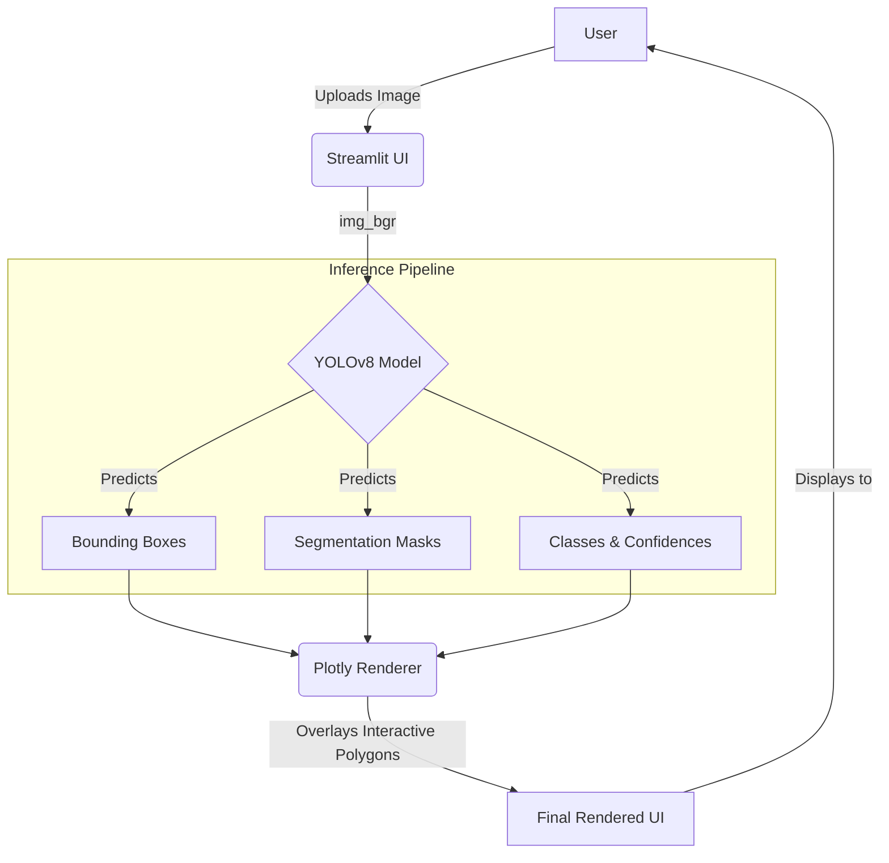

# Architecture

This document describes the high-level architecture of the AlphaDent system.

## Data Flow & Inference Pipeline

The system comprises a Streamlit web interface and a YOLOv8 backend for instance segmentation.

## Module Responsibilities
- `streamlit_app.py`: The main entry point for the web application, handling file uploads, user configuration, and Plotly-based interactive visualization.
- `train.py` / `valid.py`: Scripts responsible for training the YOLO model on custom datasets and evaluating its performance (mAP, F1-score).
- `inference.py` / `benchmark.py`: Local testing and performance benchmarking scripts designed to validate the model's speed and accuracy on the target hardware.
